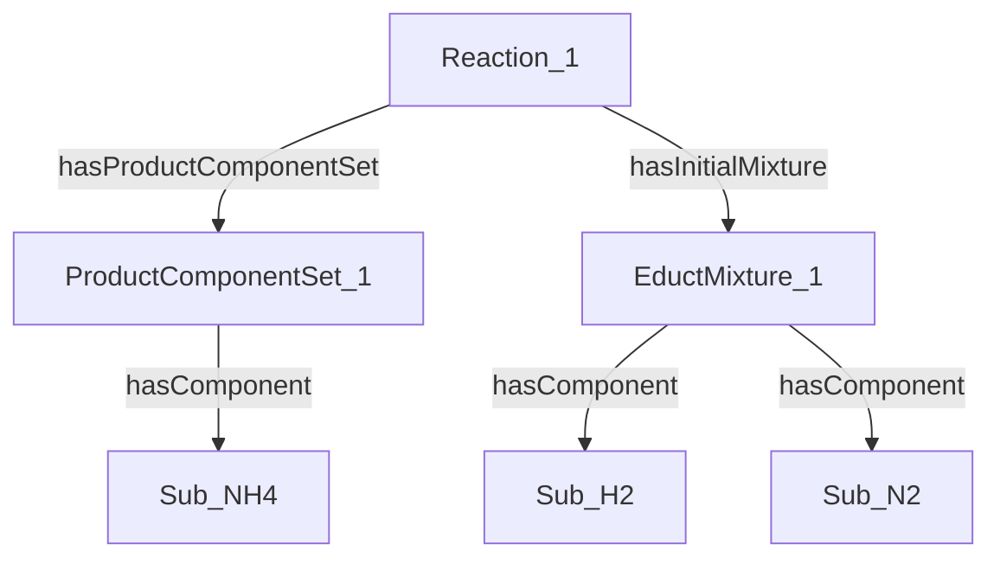

```mermaid
 graph TD;
Reaction_1--hasProductComponentSet-->ProductComponentSet_1
Reaction_1--hasInitialMixture-->EductMixture_1
ProductComponentSet_1--hasComponent-->Sub_NH4
EductMixture_1--hasComponent-->Sub_H2
EductMixture_1--hasComponent-->Sub_N2
```