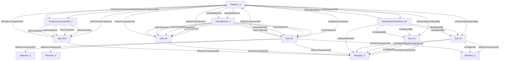

```mermaid
 graph TD;
Reaction_1--hasInitialMixture-->EductMixture_1
Reaction_1--hasInitialMixture-->EductMixture_1
Reaction_1--isPotentiallyCatalysedBy-->Sub_Fe
Reaction_1--isPotentiallyCatalysedBy-->Sub_Ni
Reaction_1--hasProductComponentSet-->ProductComponentSet_1
Reaction_1--hasProductComponentSet-->ProductComponentSet_1
Reaction_1--hasReactionRole-->HaberBoschReacRole_Ind
Reaction_1--hasEductComponent-->Sub_H2
Reaction_1--hasEductComponent-->Sub_N2
Reaction_1--hasProductComponent-->Sub_NH4
EductMixture_1--hasComponent-->Sub_H2
EductMixture_1--hasComponent-->Sub_N2
EductMixture_1--hasComponent-->Sub_H2
EductMixture_1--hasComponent-->Sub_N2
EductMixture_1--hasComponent-->Sub_H2
EductMixture_1--hasComponent-->Sub_N2
EductMixture_1--hasComponent-->Sub_H2
EductMixture_1--hasComponent-->Sub_N2
Sub_Fe--isReactionVesselComponentOf-->Reaction_2
Sub_Fe--isCatalystOf-->Reaction_2
Sub_Ni--isEductComponentOf-->Reaction_5
Sub_Ni--isCatalystSampleComponentOf-->Reaction_2
Sub_Ni--isCatalystOf-->Reaction_2
Sub_Ni--isCatalystOf-->Reaction_5
ProductComponentSet_1--hasComponent-->Sub_NH4
ProductComponentSet_1--hasComponent-->Sub_NH4
ProductComponentSet_1--hasComponent-->Sub_NH4
ProductComponentSet_1--hasComponent-->Sub_NH4
HaberBoschReacRole_Ind--isReactionRoleOf-->Reaction_1
HaberBoschReacRole_Ind--isReactionRoleOf-->Reaction_2
HaberBoschReacRole_Ind--isCatalyzedBy-->Sub_Fe
HaberBoschReacRole_Ind--isCatalyzedBy-->Sub_Ni
HaberBoschReacRole_Ind--isCatalyzedBy-->Sub_Fe
HaberBoschReacRole_Ind--isCatalyzedBy-->Sub_Ni
Sub_H2--isEductComponentOf-->Reaction_1
Sub_H2--isEductComponentOf-->Reaction_2
Sub_H2--isEductComponentOf-->Reaction_3
Sub_H2--isEductComponentOf-->Reaction_4
Sub_H2--isEductComponentOf-->Reaction_5
Sub_N2--isEductComponentOf-->Reaction_1
Sub_N2--isEductComponentOf-->Reaction_2
Sub_NH4--isProductComponentOf-->Reaction_1
Sub_NH4--isProductComponentOf-->Reaction_2
```