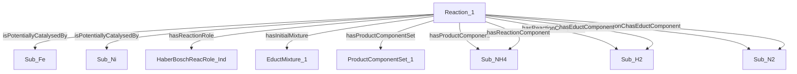

```mermaid
 graph TD;
Reaction_1--isPotentiallyCatalysedBy-->Sub_Fe
Reaction_1--isPotentiallyCatalysedBy-->Sub_Ni
Reaction_1--hasReactionRole-->HaberBoschReacRole_Ind
Reaction_1--hasInitialMixture-->EductMixture_1
Reaction_1--hasProductComponentSet-->ProductComponentSet_1
Reaction_1--hasProductComponent-->Sub_NH4
Reaction_1--hasReactionComponent-->Sub_H2
Reaction_1--hasReactionComponent-->Sub_N2
Reaction_1--hasReactionComponent-->Sub_NH4
Reaction_1--hasEductComponent-->Sub_H2
Reaction_1--hasEductComponent-->Sub_N2
```